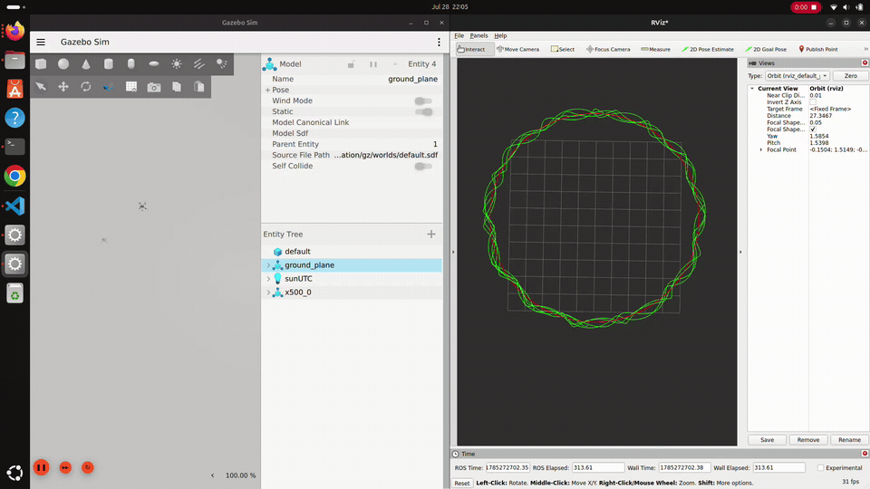

# Running the Simulation

How to build, launch, and verify the point-mass MPC controller against PX4 SITL.

For the theory behind what the controller is doing, see
[`src/px4_mpc_controller/docs/MPC_explanation.md`](../src/px4_mpc_controller/docs/MPC_explanation.md)
(dynamics and control) and
[`MPC_solver.md`](../src/px4_mpc_controller/docs/MPC_solver.md) (numerical methods).

---

## 1. One-time setup

### Build the image

```bash
cd ~/Documents/px4_mpc_ws
docker compose build
```

Expect **30-60 minutes** on a cold build. It compiles PX4 v1.17.0 from source, builds the
Micro XRCE-DDS Agent, installs Gazebo Harmonic, and colcon-builds the ROS 2 workspace.
The resulting image is ~13 GB.

If you cloned the repo fresh, make sure the `px4_msgs` submodule came with it:

```bash
git submodule update --init --recursive
```

### Allow the container to use your display

```bash
xhost +local:docker
```

Needed once per login session. Without it Gazebo and RViz cannot open a window.

### Start the container

```bash
docker compose up -d
```

Leave it running. Every terminal below attaches to this same container with:

```bash
docker compose exec -it px4_mpc bash
```

---

## 2. Running the MPC demo

You need **two terminals**, both inside the container.

### Terminal 1 — PX4 SITL + Gazebo

```bash
docker compose exec -it px4_mpc bash
cd /PX4-Autopilot
make px4_sitl gz_x500
```

Wait for the Gazebo window to open showing an x500 quadrotor on a ground plane, and for the
terminal to settle at a `pxh>` prompt.

> **Prefer a real terminal.** PX4's `pxh>` console expects stdin. If you background it with
> stdin closed it spins on EOF and floods its log with prompt redraws, which makes the log
> unreadable. It does still fly — but you lose the `pxh>` console, which is where
> `commander check` lives and that is the single most useful debugging tool when the vehicle
> won't arm. If you do need it detached, give it a FIFO on stdin rather than closing stdin:
>
> ```bash
> mkfifo /tmp/px4_in
> tail -f /tmp/px4_in | make px4_sitl gz_x500 > /tmp/px4.log 2>&1 &
> echo "commander check" > /tmp/px4_in   # inject console commands this way
> ```

You should **not** need to type anything at `pxh>`. The SITL parameter overrides in
[`sitl/4001_gz_x500.post`](../sitl/4001_gz_x500.post) are applied automatically at every boot
(see Section 5).

### Terminal 2 — the MPC stack

```bash
docker compose exec -it px4_mpc bash
ros2 launch px4_mpc_bringup mpc_nav.launch.py
```

This starts three things together:

| Node | Role |
|---|---|
| `MicroXRCEAgent` | the PX4 ↔ ROS 2 bridge (UDP port 8888) |
| `mpc_node` | solves the MPC and streams setpoints to PX4 |
| `trajectory_generator` | publishes the reference circle for visualization |
| `vehicle_pose_publisher` | republishes actual pose/path in ENU for RViz |

### What success looks like

In Terminal 2, within a couple of seconds:

```
[mpc_node-2] [INFO] ... nav_state changed -> 4
[mpc_node-2] [INFO] ... Requested Offboard mode
[mpc_node-2] [INFO] ... Requested arm (forced)
[mpc_node-2] [INFO] ... nav_state changed -> 14 (OFFBOARD engaged)
```

`nav_state 14` is `NAVIGATION_STATE_OFFBOARD`. In Gazebo the drone should lift to about 5 m
and begin flying a 5 m-radius circle.

---

## 3. Verifying it is actually working

Open a third terminal in the container for these.

**Is the drone armed and in offboard?**

```bash
ros2 topic echo --qos-profile sensor_data /fmu/out/vehicle_status_v1 --once \
  | grep -E "arming_state|nav_state:"
```

`arming_state: 2` is ARMED (`1` is disarmed). `nav_state: 14` is offboard.

**Is it moving?**

```bash
ros2 topic echo --qos-profile sensor_data /fmu/out/vehicle_local_position_v1 --once \
  | grep -E "^(x|y|z):"
```

Sample this a few seconds apart. `x` and `y` should trace a circle; `z` should sit near
`-5.0` (NED, so negative is *up*).

**Are setpoints flowing at the right rate?**

```bash
ros2 topic hz /fmu/in/trajectory_setpoint
```

Should report ~10 Hz. If this drops below 2 Hz, PX4 will drop out of offboard mode as a
failsafe.

> **The `--qos-profile sensor_data` flag is not optional.** PX4 publishes with BEST_EFFORT
> reliability; `ros2 topic echo` defaults to RELIABLE, which does not match, so it silently
> shows nothing. An empty output usually means a QoS mismatch, not a dead topic.

---

## 4. Visualizing in RViz2

In a third container terminal:

```bash
rviz2
```

Then configure once:

1. **Global Options → Fixed Frame**: type `map`
2. **Add → By topic → `/viz/vehicle_path` → Path** — the actual flown trajectory
3. **Add → By topic → `/viz/reference_path` → Path** — the reference circle
4. Give the two paths different colours (click each display, set **Color**)
5. Optionally **Add → `/viz/vehicle_pose` → Pose** for a live position marker

The gap between the two paths *is* the tracking error, visually. A correctly running stack
looks like this — Gazebo on the left, RViz2 on the right:



Red is the reference circle, green is the actual flown path over several laps.

These `/viz/*` topics are published in **ENU** (Z-up), converted from PX4's NED by
[`frames.py`](../src/px4_mpc_controller/px4_mpc_controller/frames.py). The control loop itself
stays entirely in NED; the conversion exists only so RViz displays the drone the right way up.

Save your layout with **File → Save Config As** to
`src/px4_mpc_bringup/config/mpc_nav.rviz` so you don't have to repeat this.

---

## 5. Tuning

Edit [`src/px4_mpc_controller/config/mpc_params.yaml`](../src/px4_mpc_controller/config/mpc_params.yaml):

| Parameter | Default | Effect |
|---|---|---|
| `horizon_steps` | 20 | prediction horizon length $N$ |
| `dt` | 0.1 | timestep; $N \times dt = 2.0$ s horizon |
| `max_xy_vel` / `max_z_vel` | 5.0 / 2.0 | velocity constraints (m/s) |
| `max_xy_accel` / `max_z_accel` | 3.0 / 2.0 | acceleration constraints (m/s²) |
| `weight_position` | 10.0 | position tracking weight |
| `weight_velocity` | 1.0 | velocity tracking weight |
| `weight_control` | 0.1 | control effort penalty |
| `trajectory_radius` | 5.0 | circle radius (m) |
| `trajectory_angular_rate` | 0.314159 | rad/s (≈20 s per lap) |

Only the **ratios** of the weights matter. `weight_position / weight_control = 100` is
aggressive — raise `weight_control` for smoother, less twitchy commands at the cost of looser
tracking.

After editing, rebuild inside the container:

```bash
cd /px4_mpc_ws
colcon build --packages-select px4_mpc_controller
source install/setup.bash
```

`src/` is bind-mounted, so host edits appear in the container immediately — but `colcon build`
is still needed for the installed copy that `ros2 launch` actually runs.

### SITL parameter overrides

[`sitl/4001_gz_x500.post`](../sitl/4001_gz_x500.post) is copied into PX4's airframe directory
by the Dockerfile and sourced automatically on every boot of the `gz_x500` airframe:

```sh
param set NAV_DLL_ACT 0      # don't require a GCS/RC datalink to arm
param set SIM_BAT_ENABLE 0   # disable the simulated battery model
param set COM_LOW_BAT_ACT 0  # disable the low-battery failsafe action
```

These are **simulation-only development conveniences**, not something to carry to hardware.
`NAV_DLL_ACT 0` in particular exists so that on a real aircraft, a human with an RC link can
take over if the companion computer dies. On real hardware it should be restored, with a
safety pilot present.

---

## 6. Troubleshooting

### Nothing happens; no `/fmu/*` topics exist

The bridge isn't running. `ros2 topic list | grep fmu` should show dozens of topics. If it
shows none, `MicroXRCEAgent` is not up — check Terminal 2, or start it manually:

```bash
MicroXRCEAgent udp4 -p 8888
```

PX4 connects to port 8888 by default (you'll see `uxrce_dds_client init UDP agent
IP:127.0.0.1, port:8888` in the PX4 boot log).

### `ros2 topic echo` prints nothing but the topic exists

QoS mismatch. Add `--qos-profile sensor_data`. PX4 publishes BEST_EFFORT; the default
subscriber is RELIABLE and will never match.

This is the same trap the controller code hit: `offboard_control.py` sets BEST_EFFORT +
VOLATILE explicitly for exactly this reason. TRANSIENT_LOCAL durability is *also*
incompatible and fails silently.

### Topic names ending in `_v1`

PX4 v1.17 appends a version suffix when a message's schema version is bumped. The plain names
have no publisher at all:

| Use this | Not this |
|---|---|
| `/fmu/out/vehicle_status_v1` | `/fmu/out/vehicle_status` |
| `/fmu/out/vehicle_local_position_v1` | `/fmu/out/vehicle_local_position` |

### Drone won't arm (`arming_state: 1`, `pre_flight_checks_pass: false`)

**First, get the actual reason.** Don't guess — at the `pxh>` prompt run:

```
commander check
```

This prints the specific failing check by name. Everything below is keyed to that output.

#### `Preflight Fail: heading estimate not stable`

The EKF's yaw estimate is stuck in a reset loop, almost always caused by a **corrupt
magnetometer calibration persisted in `parameters.bson`**.

Diagnose it:

```bash
ros2 topic echo --qos-profile sensor_data /fmu/out/vehicle_local_position_v1 --once \
  | grep -E "heading_var|heading_reset_counter|heading_good_for_control"
```

If `heading_reset_counter` climbs steadily (every few seconds, indefinitely) and `heading_var`
stays pinned at a fixed value instead of decreasing, the estimate is resetting faster than it
can converge. Confirm the cause:

```
param show CAL_MAG0_XOFF
```

In SITL the simulated magnetometer has **no hard-iron distortion**, so every `CAL_MAG*_?OFF`
should be `0.0000`. Any non-zero value is a bogus calibration that will corrupt the heading
estimate on every boot, because PX4 persists parameters across restarts.

**Fix — reset PX4 to factory parameters:**

```bash
# stop PX4 first, then:
rm /PX4-Autopilot/build/px4_sitl_default/rootfs/parameters.bson \
   /PX4-Autopilot/build/px4_sitl_default/rootfs/parameters_backup.bson
```

The `.post` overrides are re-applied automatically on the next boot, so nothing this project
needs is lost. After restarting, `heading_reset_counter` should settle at `1` and
`commander check` should report `Preflight check: OK`.

This is worth knowing about because it is **persistent and silent**: once a bad calibration is
saved, every subsequent run fails identically, which makes it look like a code regression when
nothing in the code changed.

#### `Preflight Fail: No connection to the GCS`

`NAV_DLL_ACT` is not `0`. Verify with `param show NAV_DLL_ACT`. It should be set automatically
by the `.post` file; if not, check that file exists at
`/PX4-Autopilot/build/px4_sitl_default/etc/init.d-posix/airframes/4001_gz_x500.post`.

#### Other causes

- **Stale nodes from a previous run.** If `mpc_node` is still running from an earlier session
  while PX4 has restarted, kill everything and start clean:
  ```bash
  pkill -f lib/px4_mpc_controller; pkill -x MicroXRCEAgent
  ```
- **Arming too early.** `mpc_node` waits for `pre_flight_checks_pass` and retries every 2 s, so
  this should self-resolve. If you see `waiting for PX4 preflight checks to pass before
  arming` repeating for more than ~60 s, run `commander check` — something is genuinely
  failing.

### Drone arms, climbs, then immediately returns and lands

Battery failsafe. `SIM_BAT_ENABLE 0` should prevent it; see item 2 above.

### Offboard mode engages then drops out

The setpoint stream stopped or fell below 2 Hz. Check `ros2 topic hz
/fmu/in/trajectory_setpoint`, and check whether `mpc_node` crashed — an infeasible solve
raises an exception and kills the node, which stops the stream. See
[`MPC_solver.md`](../src/px4_mpc_controller/docs/MPC_solver.md) Part 11.2 on why hard
constraints can go infeasible and what soft constraints would fix.

### Gazebo window doesn't open

```bash
xhost +local:docker
```

on the **host**, then restart the container.

### Everything is wedged

```bash
docker compose down
docker compose up -d
```

Then start from Section 2.

---

## 7. Stopping

`Ctrl+C` in Terminal 2 (the MPC stack), then Terminal 1 (PX4). To stop the container:

```bash
docker compose down
```
