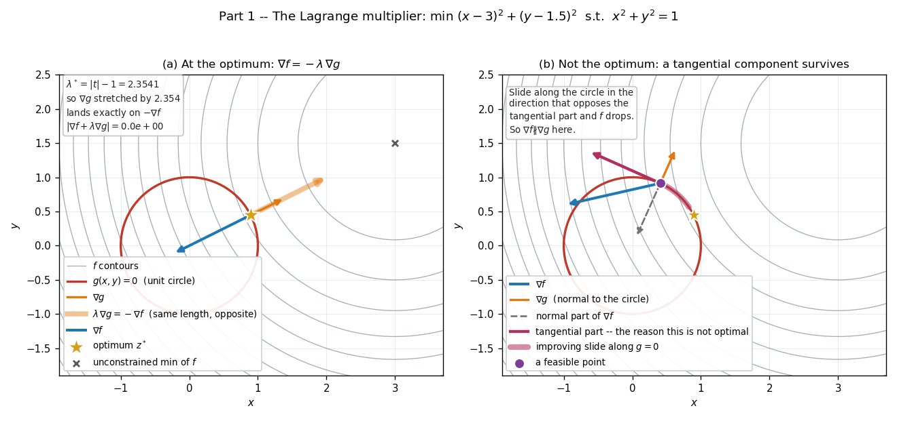
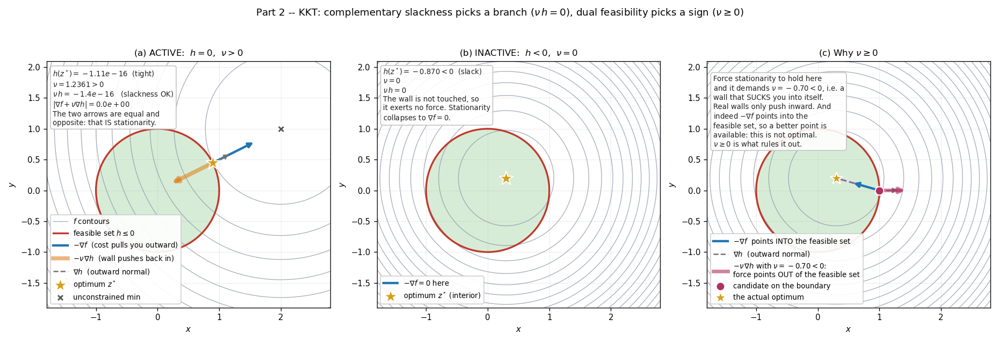
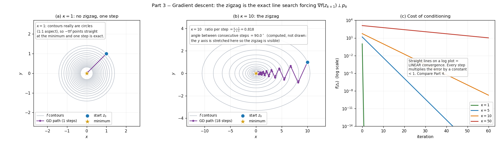
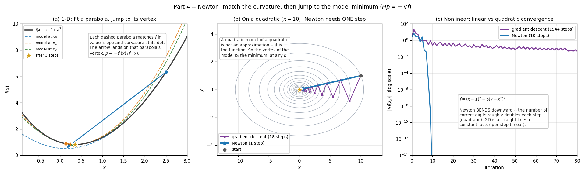
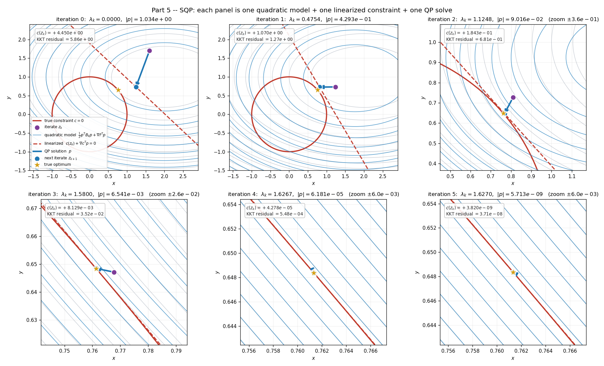
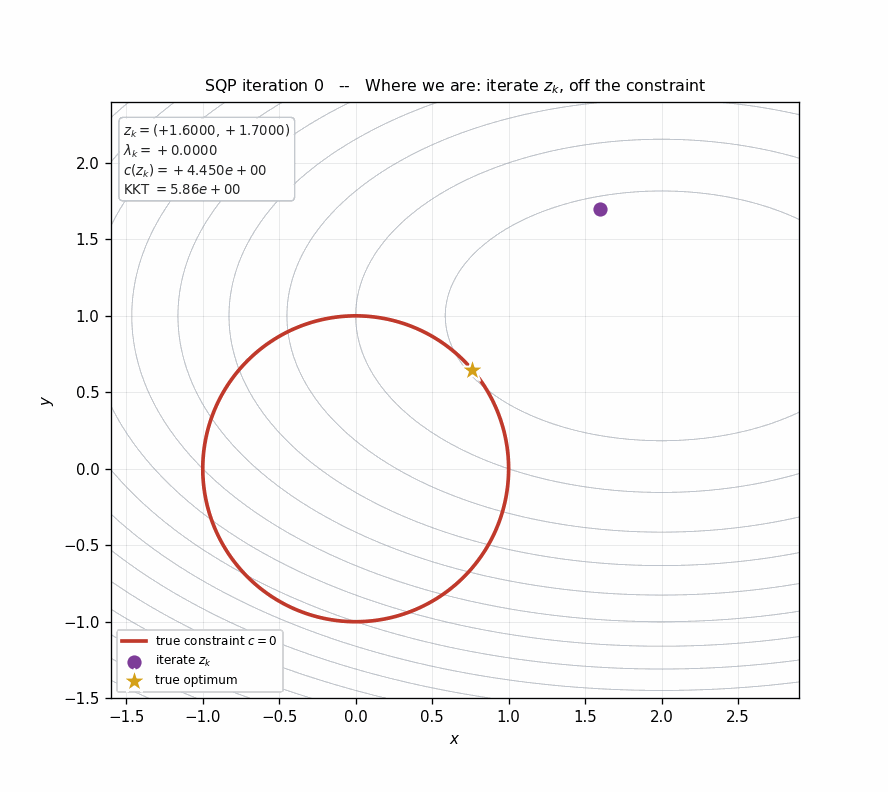

# Optimization, Visualized

Five worked examples, each small enough to solve by hand and each drawn by a
script you can rerun. The point is to see the objects from
[`MPC_explanation_my_version.md`](MPC_explanation_my_version.md) Part V and
[`MPC_solver.md`](MPC_solver.md) Parts 8-9 rather than only read their
definitions.

Every number quoted below is printed by the corresponding script — nothing here
is asserted without being computed.

## Running them

```bash
cd src/px4_mpc_controller/docs/scripts
for s in viz_0*.py; do python3 "$s"; done      # writes into ../media/
```

Only `numpy` and `matplotlib` are needed (both already in the container). Each
script takes `--outdir DIR`; `viz_05_sqp.py` also takes `--no-gif`.

| Script | Figure |
|---|---|
| `viz_01_lagrange.py` | `media/01_lagrange_multiplier.png` |
| `viz_02_kkt.py` | `media/02_kkt_conditions.png` |
| `viz_03_gradient_descent.py` | `media/03_gradient_descent.png` |
| `viz_04_newton.py` | `media/04_newton_method.png` |
| `viz_05_sqp.py` | `media/05_sqp_iterations.png`, `media/05_sqp_animation.gif` |

Colour convention, the same in every figure: **grey** contours are the
objective, **red** is a constraint, **green** fill is the feasible set,
**blue** arrows are $\nabla f$, **orange** arrows are constraint gradients,
**purple** is the path an algorithm walks, **gold star** is the optimum.

---

## Part 1 — The Lagrange multiplier



### The problem

$$\min_{x,y}\ f(x,y)=(x-3)^2+(y-1.5)^2 \qquad\text{s.t.}\qquad g(x,y)=x^2+y^2-1=0$$

In words: find the point on the unit circle closest to $t=(3,\,1.5)$. Writing
$z=(x,y)$ this is $f(z)=\|z-t\|^2$ and $g(z)=\|z\|^2-1$, so

$$\nabla f(z) = 2(z-t), \qquad \nabla g(z) = 2z$$

### The condition being visualized

$$\nabla f(z^*) + \lambda\,\nabla g(z^*) = 0$$

i.e. **the two gradients are parallel**. Solving it here takes two lines.
Substituting the gradients into stationarity:

$$2(z-t) + 2\lambda z = 0 \quad\Longrightarrow\quad z(1+\lambda)=t \quad\Longrightarrow\quad z=\frac{t}{1+\lambda}$$

and feasibility $\|z\|=1$ forces $1+\lambda=\|t\|=r$. So

$$\boxed{\;z^* = \frac{t}{r}, \qquad \lambda^* = r-1\;}$$

With $t=(3,1.5)$, $r=\sqrt{11.25}=3.354102$:

| quantity | value |
|---|---|
| $z^*$ | $(0.894427,\ 0.447214)$ |
| $\lambda^*$ | $2.354102$ |
| $\nabla f(z^*)$ | $(-4.211146,\ -2.105573)$ |
| $\nabla g(z^*)$ | $(1.788854,\ 0.894427)$ |
| $\|\nabla f+\lambda\nabla g\|$ | $0.0$ |

### How to read panel (a)

Three arrows leave the optimum. The thin orange one is $\nabla g$. The thick
pale orange one is $\lambda\nabla g$ — the *same direction*, stretched by
$2.354$. The blue one is $\nabla f$. The stretched orange arrow and the blue
arrow have exactly the same length and exactly opposite directions.

That is the whole content of the multiplier: **$\lambda$ is the number that
rescales $\nabla g$ onto $-\nabla f$.** It exists only because the two are
parallel to begin with. The target was deliberately placed far out so
$\lambda\neq1$ and the rescaling is visible.

### How to read panel (b) — why they *must* be parallel

At a different feasible point, decompose $\nabla f$ into a part normal to the
circle and a part tangent to it:

$$\nabla f = \underbrace{(\nabla f\cdot n)\,n}_{\text{normal}} + \underbrace{(\nabla f\cdot t)\,t}_{\text{tangential}}, \qquad n=\frac{\nabla g}{\|\nabla g\|},\quad t=n^{\perp}$$

The crimson arrow is that tangential part, and the thick pink arc is the move
it licenses: sliding along the circle in the direction $-\operatorname{sign}(\nabla f\cdot t)\,t$
**stays feasible and lowers $f$**. So this point cannot be optimal.

The only way no such move exists is $\nabla f\cdot t=0$ for every tangent
direction — which says $\nabla f$ is purely normal, i.e. parallel to
$\nabla g$. The Lagrange condition is not a trick; it is the statement "no
feasible direction improves," written in coordinates.

---

## Part 2 — The KKT conditions



### The problem

The circle becomes an **inequality** — stay inside the disc:

$$\min_{x,y}\ f(x,y)=\|z-t\|^2 \qquad\text{s.t.}\qquad h(x,y)=x^2+y^2-1\le0$$

### The four conditions

$$\begin{aligned}
&\textbf{stationarity} && \nabla f + \nu\,\nabla h = 0\\
&\textbf{primal feasibility} && h \le 0\\
&\textbf{dual feasibility} && \nu \ge 0\\
&\textbf{complementary slackness} && \nu\,h = 0
\end{aligned}$$

The closed form is the projection of $t$ onto the disc, and it splits into two
branches exactly as complementary slackness demands:

$$z^* = \begin{cases} t & r\le1 \quad(\text{inactive},\ \nu=0)\\[2pt] t/r & r>1 \quad(\text{active},\ \nu=r-1)\end{cases}\qquad r=\|t\|$$

### Reading it as a force balance

Stationarity rearranges to

$$\underbrace{-\nabla f}_{\text{where the cost wants to go}} = \underbrace{\nu\,\nabla h}_{\phantom{x}} \qquad\Longleftrightarrow\qquad -\nabla f + \big(-\nu\nabla h\big) = 0$$

so the two arrows drawn in panel (a) are $-\nabla f$ (the descent direction,
pointing outward toward the target) and $-\nu\nabla h$ (the constraint force,
pointing back inward). **They are equal and opposite — that cancellation
is stationarity.**

Note the sign carefully: $\nabla h$ points *out* of the feasible set, so with
$\nu>0$ the force $-\nu\nabla h$ points *in*. A wall pushes you away from
itself.

### The three panels

| panel | $t$ | $h(z^*)$ | $\nu$ | $\nu\,h$ |
|---|---|---|---|---|
| (a) ACTIVE | $(2,\ 1)$ | $-1.1\times10^{-16}$ (tight) | $1.2361$ | $-1.4\times10^{-16}$ |
| (b) INACTIVE | $(0.3,\ 0.2)$ | $-0.870$ (slack) | $0$ | $0$ |

**Complementary slackness in one sentence:** in (a) the constraint is tight so
$h=0$; in (b) the multiplier is zero so $\nu=0$. Either way the product
$\nu h$ vanishes — but by a *different factor* each time. That is why the
condition is combinatorial, and why resolving it is the hard part of every QP
algorithm (see [`writing_the_solver.md`](writing_the_solver.md) Stage 4).

**Panel (c), why $\nu\ge0$ is a real condition.** Take the interior-minimum
problem from (b) but test a boundary point $z=(1,0)$ anyway. Force
stationarity to hold there and solve for the multiplier it demands:

$$\nu = -\frac{\nabla f\cdot\nabla h}{\|\nabla h\|^2} = -0.70 < 0$$

A negative $\nu$ makes the constraint force $-\nu\nabla h$ point *outward* —
a wall that sucks you into itself. Physically impossible, and the figure shows
why it must be: $-\nabla f$ points **into** the feasible set, so a strictly
better feasible point is available one step away. Dual feasibility is exactly
the condition that rules such points out.

---

## Part 3 — Gradient descent, and why it zigzags



### The problem

$$f(x,y)=\tfrac12\left(x^2+\kappa y^2\right), \qquad \nabla^2 f = \begin{bmatrix}1&0\\0&\kappa\end{bmatrix}$$

so $\kappa$ *is* the condition number, and the contours are ellipses
$\sqrt{\kappa}$ times wider than tall.

### The iteration

$$p_k=-\nabla f(z_k), \qquad \alpha_k=\arg\min_\alpha f(z_k+\alpha p_k)=\frac{p_k^Tp_k}{p_k^T H p_k}, \qquad z_{k+1}=z_k+\alpha_k p_k$$

### Why it zigzags — two facts

**1. The gradient points at the nearest wall, not at the minimum.**
$\nabla f$ is perpendicular to the contour through $z_k$. For a *circular*
contour the perpendicular passes through the centre. For a stretched ellipse
it does not.

**2. Exact line search forces consecutive steps to be orthogonal.** Stopping
at the minimum along a line means the derivative along that line is zero:

$$\frac{d}{d\alpha}f(z_k+\alpha p_k)\Big|_{\alpha_k}=\nabla f(z_{k+1})^Tp_k=0
\quad\Longrightarrow\quad p_{k+1}\perp p_k$$

Every step is at a right angle to the last one. The script measures the angle
between consecutive steps and prints **90.0°** — the zigzag is forced by the
line search, not an accident of the starting point.

### The closed form

From $z_0=(\kappa,1)$ the iterates are exactly

$$z_k=\rho^k\big(\kappa,\ (-1)^k\big), \qquad \rho=\frac{\kappa-1}{\kappa+1}$$

The $(-1)^k$ *is* the zigzag, algebraically. Error shrinks by a constant
factor $\rho$ each step — **linear convergence**, which is why panel (c) shows
straight lines on a log scale:

| $\kappa$ | $\rho=\frac{\kappa-1}{\kappa+1}$ | steps to $f<10^{-10}$ |
|---|---|---|
| 1 | 0.0000 | **1** |
| 10 | 0.8182 | 68 |
| 50 | 0.9608 | 201 |

At $\kappa=1$ the method is exact in one step. Nothing about the algorithm
changed between those rows — only the conditioning. **Conditioning is what
costs you, not the algorithm.**

> Panel (a) is drawn at a true 1:1 aspect ratio, so its contours really are
> circles. Panel (b) stretches the $y$ axis, or the zigzag would be a few
> percent of the plot width and invisible; the 90° figure quoted there is
> computed from the vectors, not measured off the picture.

---

## Part 4 — Newton's method



### The idea

Gradient descent knows only a slope, so it can choose a direction but not a
distance — the step length has to be found by searching. Newton fits a local
**parabola** matching value, slope *and* curvature, then jumps to its vertex.

$$m(p)=f(z_k)+\nabla f(z_k)^Tp+\tfrac12p^TH(z_k)\,p$$

$$\nabla m(p)=\nabla f(z_k)+H(z_k)\,p=0 \quad\Longrightarrow\quad \boxed{\;H(z_k)\,p=-\nabla f(z_k)\;}$$

In one dimension that is just $p=-f'(x)/f''(x)$.

### Panel (a) — 1-D, $f(x)=e^{-x}+x^2$

$f'(x)=-e^{-x}+2x$, $f''(x)=e^{-x}+2>0$ everywhere, so $f$ is convex and each
dashed parabola opens upward and has a genuine vertex to jump to.

| $k$ | $x_k$ | $f'(x_k)$ |
|---|---|---|
| 0 | 2.5000000000 | $+4.918\times10^{0}$ |
| 1 | 0.1379854787 | $-5.951\times10^{-1}$ |
| 2 | 0.3452711995 | $-1.749\times10^{-2}$ |
| 3 | 0.3517282633 | $-1.473\times10^{-5}$ |
| 4 | 0.3517337112 | — |

Watch the exponents on $f'$: $10^{0}\to10^{-1}\to10^{-2}\to10^{-5}$. The
number of correct digits roughly doubles each step.

### Panel (b) — on a quadratic, one step, always

If $f$ is itself quadratic then $m(p)$ is not an approximation — it *is* $f$.
So the vertex of the model is the true minimum and Newton lands on it in a
single step, **at any condition number**. The same $\kappa=10$ problem cost
gradient descent 18 steps in Part 3.

This is the cleanest statement of what Newton buys: curvature is exactly the
information that conditioning destroys, and Newton uses it. $H^{-1}$ undoes
the stretching that made the ellipses elongated in the first place.

### Panel (c) — genuinely nonlinear

$$f(x,y)=(x-1)^2+5\,(y-x^2)^2$$

Here the model is only local and Newton is no longer exact, but the *rate*
survives:

| method | steps to $\|\nabla f\|<10^{-12}$ |
|---|---|
| gradient descent (Armijo) | 1544 |
| Newton (safeguarded) | **10** |

On the log plot gradient descent is a **straight line** (constant factor per
step — linear) while Newton **bends downward** (error squares each step —
quadratic). That bend is the visual signature of quadratic convergence.

### The safeguard, and why it matters later

Away from the minimum $H$ can fail to be positive definite. Then the model is
a saddle or an upside-down bowl, it has no minimum to jump to, and the "Newton
step" can point uphill. The script shifts $H\to H+\tau I$ with
$\tau=|\lambda_{\min}|+10^{-3}$ whenever $\lambda_{\min}\le0$, and backtracks
with an Armijo condition on top.

This is the same problem, and the same fix, as `hessian_regularization` in
[`../px4_mpc_controller/solvers/sqp.py`](../px4_mpc_controller/solvers/sqp.py).

---

## Part 5 — SQP, one iteration at a time





### The problem — nonlinear objective *and* nonlinear constraint

$$\min_{x,y}\ f(x,y)=(x-2)^2+3(y-1)^2 \qquad\text{s.t.}\qquad c(x,y)=x^2+y^2-1=0$$

$$\nabla f=\begin{bmatrix}2(x-2)\\6(y-1)\end{bmatrix},\quad \nabla^2f=\begin{bmatrix}2&0\\0&6\end{bmatrix},\quad \nabla c=\begin{bmatrix}2x\\2y\end{bmatrix},\quad \nabla^2c=2I$$

SQP never solves this. At each iterate it builds an easier problem that looks
like it locally, solves *that*, steps, and repeats.

### One SQP iteration, in four moves

**1. Quadratic model of the objective**, using the Hessian of the
**Lagrangian** $\mathcal L=f+\lambda c$:

$$B_k=\nabla^2f+\lambda_k\nabla^2c=\begin{bmatrix}2+2\lambda_k&0\\0&6+2\lambda_k\end{bmatrix}$$

Not $\nabla^2 f$. The QP is about to treat the constraint as a straight line,
so the curvature the line throws away has to be carried somewhere — and
$\lambda\nabla^2c$ is where it goes. Get this wrong and the method still runs
but loses its convergence rate (`MPC_solver.md` Part 8.2).

**2. Linearize the constraint** at $z_k$:

$$c(z_k)+\nabla c(z_k)^Tp=0$$

The circle becomes its tangent line (red dashed). The constant term $c(z_k)$ is
what pulls an infeasible iterate back toward the circle.

**3. Solve the QP subproblem** for the step $p$:

$$\min_p\ \tfrac12p^TB_kp+\nabla f(z_k)^Tp \qquad\text{s.t.}\qquad \nabla c(z_k)^Tp=-c(z_k)$$

Its own Lagrangian is $\tfrac12p^TB_kp+\nabla f^Tp+\lambda(c+\nabla c^Tp)$, and
setting its gradient to zero alongside the constraint gives a $3\times3$
system:

$$\begin{bmatrix}B_k & \nabla c\\ \nabla c^T & 0\end{bmatrix}\begin{bmatrix}p\\ \lambda_{k+1}\end{bmatrix}=\begin{bmatrix}-\nabla f(z_k)\\ -c(z_k)\end{bmatrix}$$

This is exactly the saddle-point system that `_solve_augmented` in
[`solvers/qp.py`](../px4_mpc_controller/solvers/qp.py) is written to solve —
here at size 3 instead of 312. Note the payoff: **the QP's own multiplier
becomes the next $\lambda$ for free**, which is where the outer loop gets its
multiplier estimates.

**4. Step** to $z_{k+1}=z_k+p$ and repeat.

### What actually happened

Starting from $z_0=(1.6,\ 1.7)$, which is well off the circle ($c=4.45$):

| it | $x_k$ | $y_k$ | $\lambda_k$ | $\|p\|$ | $c(z_k)$ | KKT residual |
|---:|---:|---:|---:|---:|---:|---:|
| 0 | 1.60000000 | 1.70000000 | 0.000000 | 1.03e+00 | +4.450e+00 | 5.86e+00 |
| 1 | 1.23935667 | 0.73060549 | 0.475402 | 4.29e-01 | +1.070e+00 | 1.27e+00 |
| 2 | 0.81007152 | 0.72669469 | 1.124786 | 9.02e-02 | +1.843e-01 | 6.81e-01 |
| 3 | 0.76771137 | 0.64710725 | 1.580027 | 6.54e-03 | +8.129e-03 | 3.52e-02 |
| 4 | 0.76130492 | 0.64842702 | 1.626676 | 6.18e-05 | +4.278e-05 | 5.48e-04 |
| 5 | 0.76132623 | 0.64836901 | 1.626995 | 5.71e-09 | +3.820e-09 | 3.71e-08 |
| 6 | 0.76132623 | 0.64836901 | 1.626995 | 8.45e-17 | 0.000e+00 | 4.44e-16 |

Converged to $z^*=(0.76132623,\ 0.64836901)$, $\lambda^*=1.62699474$.

Check it by hand: stationarity gives $x=\dfrac{2}{1+\lambda}$ and
$y=\dfrac{3}{3+\lambda}$; substituting $\lambda^*$ gives $0.761326$ and
$0.648369$. ✓

Look at the last three KKT residuals: $5.48\times10^{-4}\to3.71\times10^{-8}\to4.44\times10^{-16}$.
Each is the square of the one before. **That is the quadratic convergence
Newton bought in Part 4, surviving into the constrained case** — which is the
entire reason SQP is built on a Newton-type step rather than a gradient step.

### What the zoom reveals

Panels 0-1 are drawn at full scale; from panel 2 each zooms to its own step
size. At iteration 2 the true circle visibly curves away from the dashed
tangent line. By iteration 4 they are indistinguishable at any zoom the plot
can show.

That is the mechanism in one picture: **the linearization is wrong almost
everywhere, but it is right where it is used.** As the steps shrink, the
region where it is used shrinks faster than the error grows. SQP is a sequence
of deliberately wrong problems whose answers converge to the right one.

### Note on the iterates

They approach the optimum from *outside* the circle — no iterate is ever
exactly feasible until the limit. SQP does not maintain feasibility; it drives
feasibility and optimality to zero *together*, which is why the KKT residual
in the table mixes both $\|\nabla f+\lambda\nabla c\|$ and $|c|$.

---

## Where this connects

| Seen here | Used in |
|---|---|
| Multipliers as shadow prices | `sqp_details.md`, "Finding the active set"; `QpSolution.nu` |
| KKT four conditions | `MPC_explanation_my_version.md` Part V Step 7; `qp.kkt_residuals` |
| Complementary slackness is combinatorial | `writing_the_solver.md` Stage 4 |
| Newton step $Hp=-\nabla f$ | `MPC_solver.md` Part 8 |
| Hessian regularization | `solvers/sqp.py`, `hessian_regularization` |
| The $3\times3$ KKT system | `solvers/qp.py`, `_solve_augmented` (at size 312) |
| SQP outer loop | `solvers/sqp.py`, `solve_sqp` |

The 2D examples here are 2 and 4 variables. The MPC in `mpc_solver.py` is 186
variables with 126 equality and 240 inequality constraints. The geometry is
identical — only the dimension changes, and no picture survives it. That is
what `kkt_residuals` is for: it is the same check as "are the arrows parallel,"
performed in a space you cannot draw.
